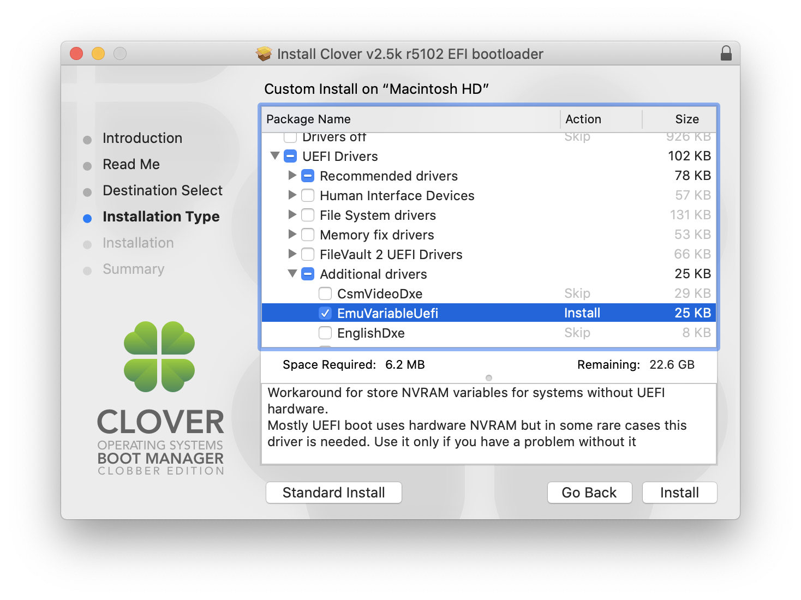
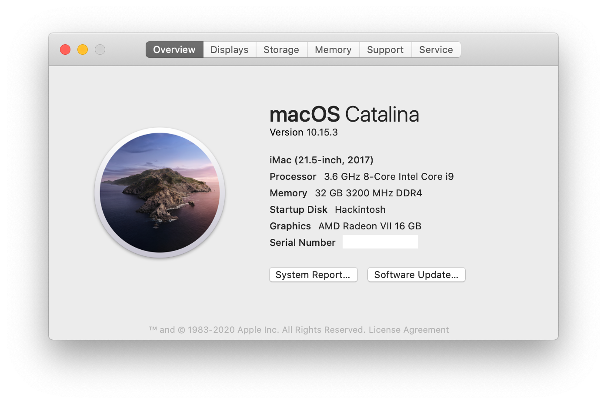
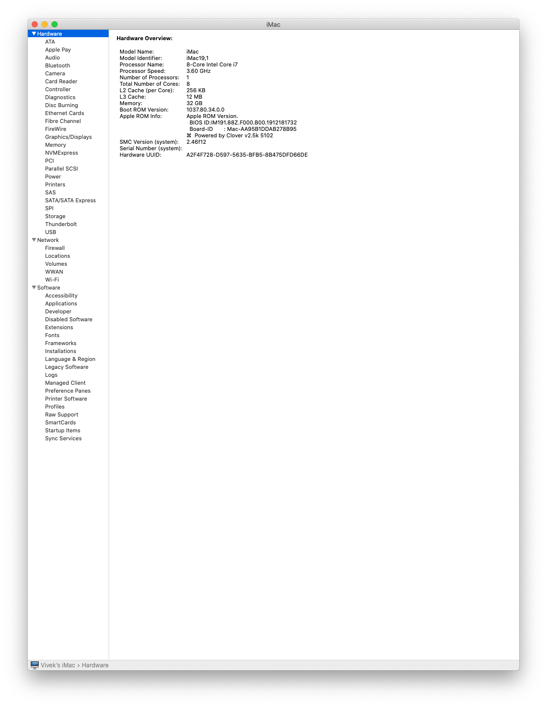
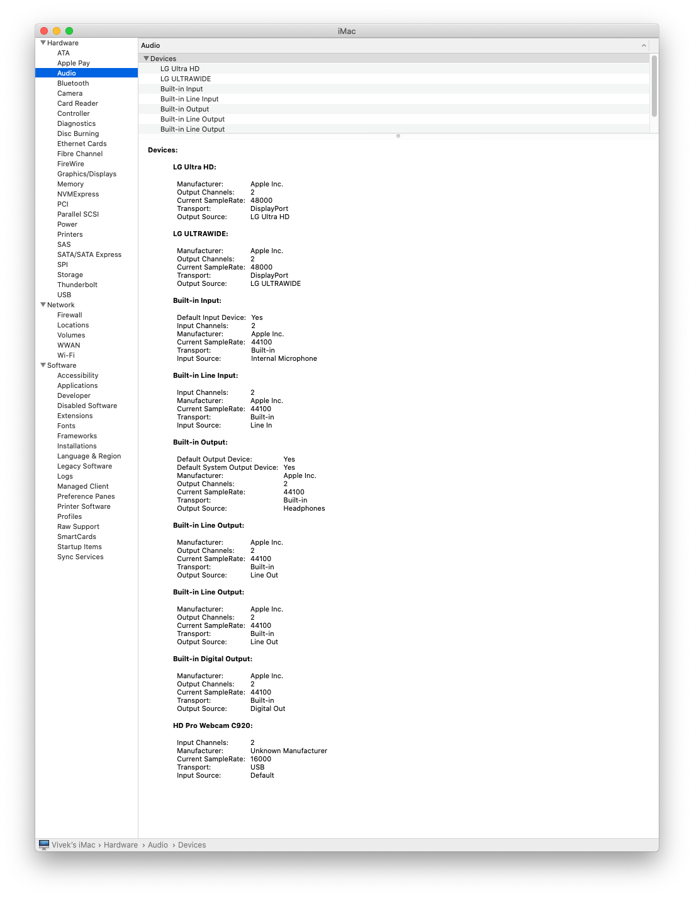
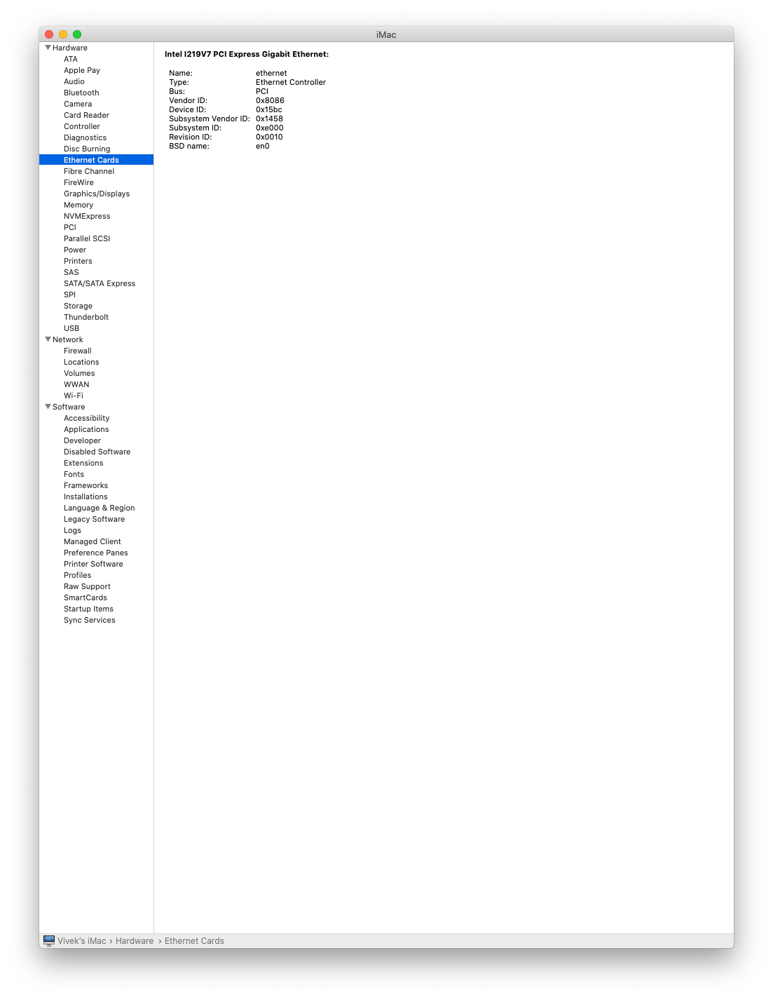
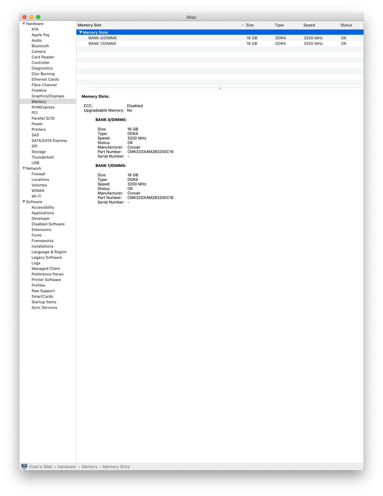
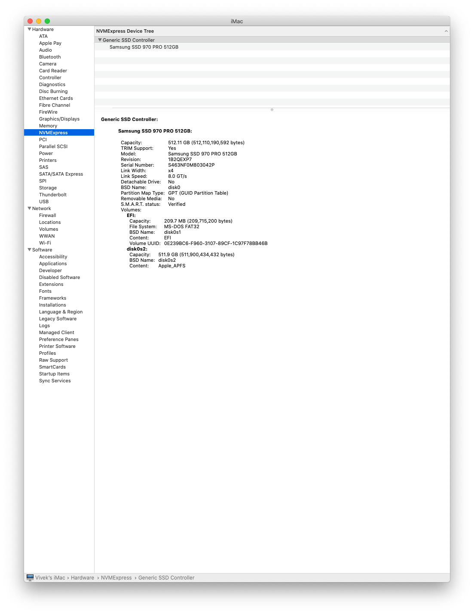
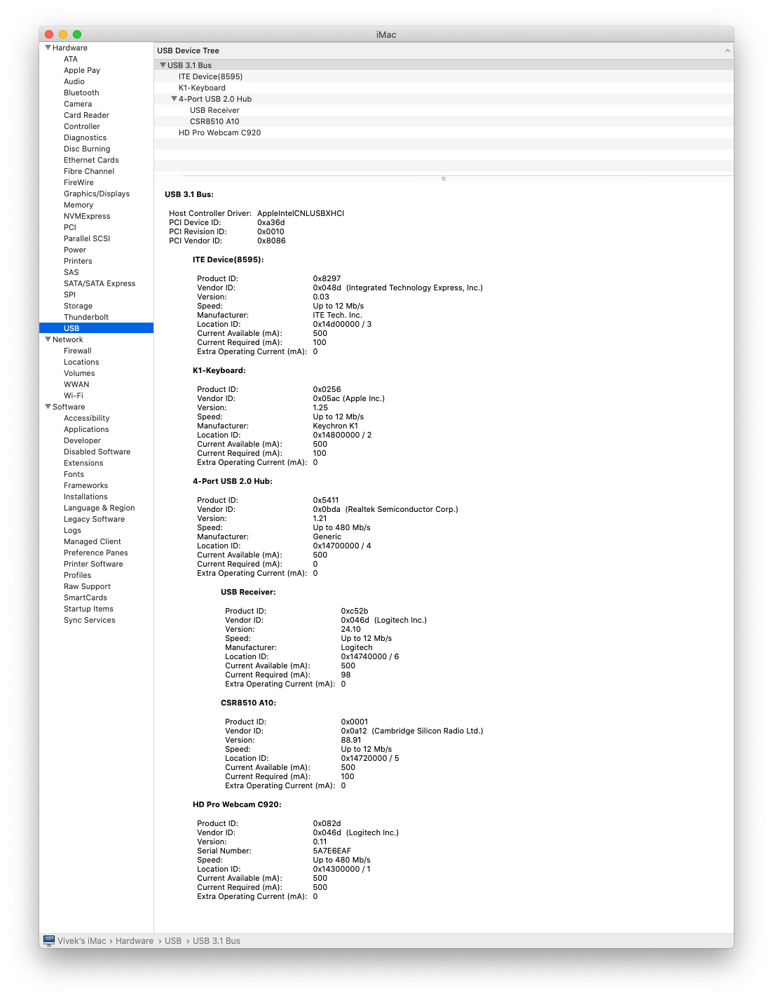

# Hackintosh Catalina Installation Guide for Gigabyte Z390-I Aorus Pro Wifi Motherboard

Vanilla Hackintosh guide for the z390-i AORUS motherboard using clover bootloader.

I followed this guide:

https://hackintosh.gitbook.io/-r-hackintosh-vanilla-desktop-guide/

## Hardware

- Gigabyte Z390-I Aorus Pro Wifi
- Intel Core i7-9700K
- 2 x Corsair LPX 16GB DDR4 3200MHz (32GB kit)
- AMD Radeon VII 16 GB
- Samsung 970 EVO Pro NVMe M.2 SSD 512 GB
- Corsair SFX 600W PSU
- Louqe Ghost S1

## What works

- Sleep / Wake
- Audio (select internal speakers)
- Ethernet
- Bluetooth (lag when Wi-Fi is on)
- 15 USB port with 3.0 Speeds

## What doesn't work (without hardware adjustments)

- Onboard Wi-Fi

## Installation Guide

### USB Installer

Follow the Vanilla guide to create a USB installer

After creating a USB installer, we need to install Clover bootloader to the USB key. Follow the directions in the Clover Setup portion of the Vanilla Guide. In addition to these steps, we need to add one more driver to make our Z390-I board work. Under the UEFI Drivers, select `Additional Drivers -> EmuVariableUefi`.

After Clover Bootalder has finished installing on our USB drive, drag all necessary kexts to the mounted EFI parition of the USB drive. In case of the Z390-I Aorus Pro motherboard, the kexts suggested on the Vanilla Guide are all we need.

### Config.plist

After our USB installer is prepared, we need the proper `config.plist` file that works for our CPU. Since this build has the 9700K, we require the `sample.plist` file for the `CoffeeLake` CPU, provided here: [https://github.com/corpnewt/Hackintosh-Guide/blob/master/Configs/CoffeeLake/config.plist](https://github.com/corpnewt/Hackintosh-Guide/blob/master/Configs/CoffeeLake/config.plist)

Replace the current config.plist with the raw text from above and save.

### Bios Config (version F5)

The bios does not have to be version F5. However, I found this version easier to navigate to find specific settings. Below is each setting separated by the main label give in the bios.

**M.I.T.**
`Advanced Frequency Settings -> Extreme Memory Profile -> Profile 1`

**Bios**  
`Fast Boot --> Disabled`  
`CSM Support --> Disabled`  
`Windows 8/10 Features --> Windows 8/10`

**Peripherals**  
`Intel Platform Trust Technology --> Disabled`  
`Software Guard Extensions --> Disabled`

**Peripherals --> USB Configuration**  
`Legacy USB Support -> Enabled`  
`XHCI Hand-off -> Enabled`

**Peripherals --> Network Stack Configuration**  
`Network Stack -> Disabled`

**Chipset**  
`VT-d --> Disabled`  
`Internal Graphics --> Enabled`  
`Above 4G Decoding --> Enabled`

### All of our files and settings are now complete! Boot from USB and install!

## Post Installation Guide

There are a couple of things to take care of specific to our build for post-installation, though the Hackintosh, in general, is up and running and should completely work.

### Fix CPU Type

If we check "About This Mac", we'll notice that the preferences are displaying the i9-9900k, and our SMBIOS is a 2017 iMac.

Lets first fix our CPU Type, which is currently displaying as a 9900k.

We need to remedy this by fixing the `CPU Type`. This is done within Clover Configurator. Open our `config.plist` file with Clover Configurator, and navigate to CPU. In the CPU settings, set the CPU Type to `0x0705` and save.

This will configure the CPU type in our config.plist to properly display the i7-9700k.

### Fix SMBIOS

We want to set the SMBIOS to iMac19,1 to closer reflect our build. To do this, open our `config.plist` with Clover Configurator, and navigate to SMBIOS. From the dropdown list, select the desired SMBIOS from the dropdown list at the bottom left (shown in the screenshot). After selecting SMBIOS, make sure to save.

We should now see proper system information about our Hackintosh: i7-9700k, and iMac 19,1

## USB Mapping

(Coming Soon)

## macOS System Information

## Benchmark

(Coming Soon)
